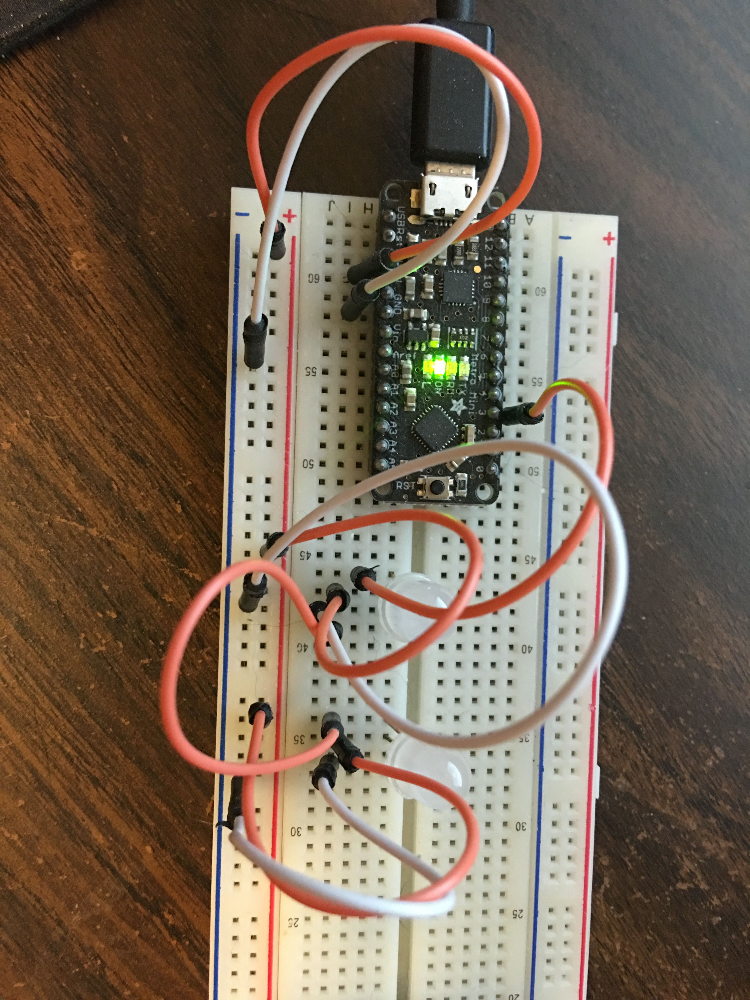

# Adafruit radiator

The goal is to make a cheap device that will light up some multi-color neopixels to indicate the status of a CI job, probably running in Jenkins or Team City

* **blue** - running
* **green** - passed
* **red** - failed

## Material
* [5 volt Metro Mini](https://www.adafruit.com/product/2590)
* [Pack of 5 8mm NeoPixels](http://www.adafruit.com/products/1734)
* A micro USB cable to power and program the Arduino.
* Breadboard
* Jumper wires

## Getting Started

* Download the [Arduino IDE](http://www.arduino.cc/en/main/software)
* Load the trinket_code.ino into the IDO and press the compile button
* Wire up the 5V, Ground and I/O pin 3 to the data in of your [NeoPixel pinout](http://www.adafruit.com/images/1200x900/1734-04.jpg)
* Connect the Trinket to your computer with the USB cable
* Press the reset button on the Arduino, and within 10 seconds, press the upload button in the IDE
* A yellow light will blink a little then the the Arduino is ready to take commands
* Run the server on the laptop, you should see the prompt message from the Arduino: Radiator started!
* While running the server you can type in commands like: red, blue, green and black followed by a return.
* Code more to make this a radiator

